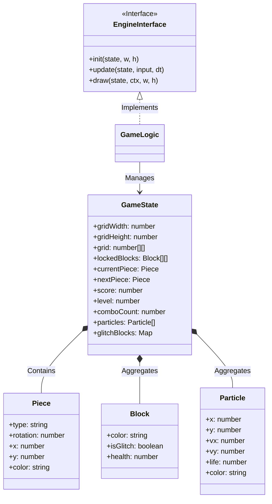
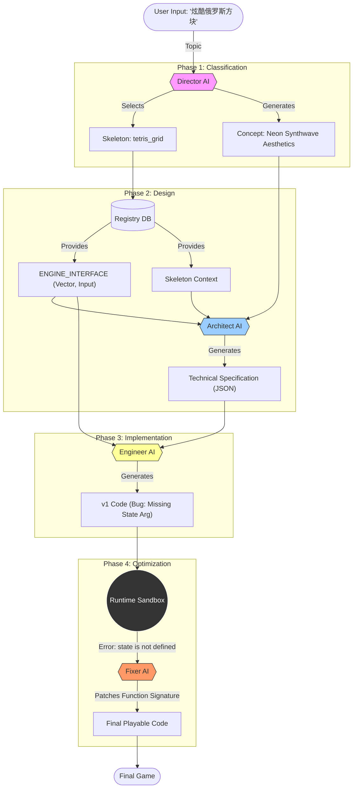

[API/CREATE] Topic: 炫酷俄罗斯方块
[API/CREATE] Phase 1: Director Classification
[DIRECTOR] ========== Classification Started ==========
[DIRECTOR] Topic: 炫酷俄罗斯方块
[DIRECTOR] Built dynamic directory with 17 skeletons
[DIRECTOR] Loaded skeleton directory with 17 types
[DIRECTOR] Using dynamic system prompt (v2)
[DIRECTOR] Calling AI for classification...
[AI-CLIENT] Calling Main AI...
[AI-CLIENT] >>> REQUEST MESSAGES >>>
[
  {
    "role": "system",
    "content": "You are a Game Design Director. You MUST return ONLY a JSON object with \"skeletonId\" and \"expandedDesign\" keys. NO other text."
  },
  {
    "role": "user",
    "content": "You are a Game Design Director. Select the best skeleton and provide a CONCISE design concept.\n\n=== CRITICAL: Output Limits ===\n- expandedDesign: MAX 150 words\n- Focus on: core mechanic, visual style, win condition\n- NO backstory, NO philosophy, NO detailed lore\n\n=== Output Format ===\nReturn JSON only:\n{\n  \"skeletonId\": \"ID\",\n  \"expandedDesign\": \"Concise gameplay description (< 150 words)\"\n}\n\nAvailable Skeletons:\n1. breakout_paddle: Control a paddle to bounce a ball and break blocks using physics-based collisions.\n2. bullet_hell: Navigate through dense patterns of projectiles with precise movement and small hitboxes.\n3. click_eliminate: Match and eliminate groups of similar items by clicking. Gravity refills gaps from above.\n4. dodge_falling: Move horizontally to avoid falling objects that spawn from the top of the screen.\n5. endless_runner: Auto-scrolling game where player jumps or slides to avoid procedurally generated obstacles.\n6. gravity_platformer: Jump across platforms with realistic gravity and collision detection.\n7. impulse_physics: Physics-based gameplay using forces, impulses, and vector math for realistic movement.\n8. match3: Swap adjacent tiles to create matches of 3+ identical items, triggering cascades.\n9. maze_pathfinding: Navigate through grid-based mazes with pathfinding enemies and line-of-sight mechanics.\n10. scrolling_shooter: Fly through scrolling space while shooting enemies and collecting power-ups.\n11. snake_grid: Grow a snake by eating food while avoiding walls and your own tail in grid-based movement.\n12. survival_shooter: Top-down shooter where player aims at cursor and survives waves of enemies from all directions.\n13. tetris_grid: Rotate and place falling blocks to form complete lines in a 2D grid.\n14. tower_defense: Place defensive towers along a path to stop waves of enemies from reaching your base.\n15. turnbased_grid: Grid-based strategy where player and enemies take turns moving and attacking.\n16. universal_collection: Race against time to collect items scattered across the screen with fast-paced movement.\n17. universal_minimal: Flexible template for any game concept without predefined mechanics.\n\nUser Input: \"炫酷俄罗斯方块\""
  }
]
[AI-CLIENT] <<< END REQUEST MESSAGES <<<
[AI-CLIENT] >>> RAW RESPONSE >>>
{
  "skeletonId": "tetris_grid",
  "expandedDesign": "A high-octane, neon-infused reimagining of the classic block-stacker. Core mechanics focus on traditional line-clearing, enhanced by a 'Combo Burst' system where multi-line clears trigger explosive particle effects and screen-shake. Visual style adopts a vibrant synthwave aesthetic with glowing HDR tetrominoes, trailing light embers, and a reactive grid that pulses to a rhythmic techno beat. The win condition is score-based survival; players must hit point milestones to advance 'Intensity Levels,' which progressively increase gravity and introduce 'Glitch Blocks' that must be cleared twice. The goal is to maximize the score before the blocks reach the screen's ceiling."
}
[AI-CLIENT] <<< END RAW RESPONSE <<<
[DIRECTOR] AI response received in 5726 ms
[DIRECTOR] Parsing classification result...
[DIRECTOR] Selected skeleton: tetris_grid
[DIRECTOR] Expanded design length: 677 chars
[DIRECTOR] ========== Classification Complete ==========    
[API/CREATE] Selected skeleton: tetris_grid
[API/CREATE] Design length: 677
[API/CREATE] Phase 2: Loading Skeleton Context
[REGISTRY] Loading dynamic skeleton from DB: tetris_grid    
[API/CREATE] Skeleton loaded: Rotate and place falling blocks to form complete lines in a 2D grid.
[API/CREATE] Phase 2.5: Architect Spec Generation
[ArchitectService] Generating Spec...
[AI-CLIENT] Calling Small AI (Gemini)...
[AI-CLIENT] >>> REQUEST MESSAGES >>>
[
  {
    "role": "system",
    "content": "You are the **Lead Game Architect**. \nYour goal is to translate a high-level Game Concept into a precise **Technical Implementation Spec** for an Engineer.\n\nInput Context:\n1. **Game Concept**: The creative vision (theme, mechanics, goals).\n2. **Skeleton**: The structural foundation (genre, boundaries).\n3. **The Constitution**: Critical system constraints that MUST be obeyed (e.g., \"No external assets\", \"dt is in seconds\").\n\nYour Process:\n1. **Analyze**: Check if the Concept violates any Constitutional Rules (e.g., asks for MP3 files when banned). If so, adapt the design to fit the rules (e.g., use procedural sound).\n2. **Architect**: Design the core data structures and algorithms appropriately for a single-file implementations.\n3. **Specify**: valid HTML5 Canvas API solutions for visuals.\n\nOutput Format (Markdown):\n# TECHNICAL IMPLEMENTATION SPEC: [Game Title]\n\n## 1. STATE SCHEMA\nDefine the exact JS objects.\n- `GameState`: { ... }\n- `Entities`: [{ ... }]\n\n## 2. CORE LOGIC\nDescribe *how* to implement complex mechanics. Use **Pseudo-code** or detailed steps.\n- **Mechanic A**: Explanation...\n- **Mechanic B**: Explanation...\n\n## 3. VISUAL IMPLEMENTATION\nhow to draw effects using *only* standard Canvas API (`ctx.lineTo`, `ctx.arc`, etc.).\n- **Effect A**: Layers/Composition...\n- **Effect B**: Animation math..."     
  },
  {
    "role": "user",
    "content": "=== INPUTS ===\n1. Concept: \"A high-octane, neon-infused reimagining of the classic block-stacker. Core mechanics focus on traditional line-clearing, enhanced by a 'Combo Burst' system where multi-line clears trigger explosive particle effects and screen-shake. Visual style adopts a vibrant synthwave aesthetic with glowing HDR tetrominoes, trailing light embers, and a reactive grid that pulses to a rhythmic techno beat. The win condition is score-based survival; players must hit point milestones to advance 'Intensity Levels,' which progressively increase gravity and introduce 'Glitch Blocks' that must be cleared twice. The goal is to maximize the score before the blocks reach the screen's ceiling.\"\n2. Skeleton: \"Rotate and place falling blocks to form complete lines in a 2D grid.\" (Details: # Game Logic Guidelines\nPending implementation...)\n3. The Constitution:\n- NO external libraries or assets (images/sounds).\n- dt is in SECONDS.\n- Standard HTML5 Canvas API only.\n- Single file output constraints."
  }
]
[AI-CLIENT] <<< END REQUEST MESSAGES <<<
[AI-CLIENT] >>> RAW RESPONSE >>>
# TECHNICAL IMPLEMENTATION SPEC: Neon Tetris: Synthwave Survival

## 1. STATE SCHEMA

```javascript
/**
 * Represents the entire game state.
 */
let GameState = {
    gridWidth: 10, // Standard Tetris width
    gridHeight: 20, // Standard Tetris height
    grid: Array(this.gridHeight).fill(null).map(() => Array(this.gridWidth).fill(0)), // 0 for empty, 1 for filled      
    currentPiece: {
        type: null, // e.g., 'I', 'J', 'L', 'O', 'S', 'T', 'Z'
        rotation: 0,
        x: 0,
        y: 0,
        color: null, // Hex color string for neon glow      
    },
    nextPiece: {
        type: null,
        color: null,
    },
    score: 0,
    level: 1,
    linesCleared: 0,
    isGameOver: false,
    comboCount: 0, // Tracks consecutive multi-line clears  
    fallSpeed: 1.0, // Seconds per grid step, decreases with level
    gravityMultiplier: 1.0, // Multiplies fallSpeed
    gameTick: 0, // Increments each game loop iteration for timing
    lastFallTime: 0, // Timestamp of the last piece fall    
    controls: {
        left: false,
        right: false,
        down: false,
        rotate: false,
    },
    glitchBlockTypes: [], // Array of piece types that are currently Glitch Blocks
    glitchBlockState: {}, // Tracks individual glitch block progress (e.g., { x: y: health: })
};

/**
 * Represents a single block on the grid or a piece.        
 */
let Block = {
    x: 0,
    y: 0,
    color: "#FFFFFF", // Default white, will be overridden by neon colors
    isGlitch: false, // True if this block is currently a Glitch Block
    glitchHealth: 2, // How many times it needs to be hit/cleared
};

/**
 * Stores all active pieces on the grid (when they are locked in).
 * This will be an array of arrays, where each inner array represents a row
 * and contains Block objects for filled cells.
 */
let Entities = {
    lockedBlocks: Array(GameState.gridHeight).fill(null).map(() => Array(GameState.gridWidth).fill(null)), // null for empty, Block object for filled
};
```

## 2. CORE LOGIC

### Mechanic A: Piece Movement and Rotation

1.  **Spawn New Piece**: When `currentPiece` is null or has just been locked, select a new piece type and assign a random neon color. Place it at the top-center of the grid. Check for immediate collision (game over condition).
2.  **Apply Gravity**: If `gameTick - lastFallTime >= fallSpeed * gravityMultiplier`, attempt to move the `currentPiece` down by one grid unit.
    *   **Collision Detection**: Before moving down, check if the `currentPiece` would collide with the bottom of the grid or any `lockedBlocks` in its target position.
    *   **If Collision**: Lock the `currentPiece` into `Entities.lockedBlocks`, clear full lines, and spawn a new piece.
    *   **If No Collision**: Update `currentPiece.y` and `lastFallTime`.
3.  **Horizontal Movement**: If `GameState.controls.left` is true, attempt to move `currentPiece` left by one grid unit. Perform collision detection. If no collision, update `currentPiece.x`.
4.  **Horizontal Movement**: If `GameState.controls.right` is true, attempt to move `currentPiece` right by one grid unit. Perform collision detection. If no collision, update `currentPiece.x`.
5.  **Soft Drop**: If `GameState.controls.down` is true, attempt to move `currentPiece` down by one grid unit. Perform collision detection. If no collision, update `currentPiece.y` and reset `lastFallTime` to speed up falls.
6.  **Rotation**: If `GameState.controls.rotate` is true, calculate the new `rotation` state for the `currentPiece`. Check if the rotated piece collides with grid boundaries or `lockedBlocks`.
    *   **Wall Kick**: If direct rotation causes a collision, attempt to "kick" the piece by shifting it horizontally one unit left or right. If a valid position is found, apply the rotation. If not, the rotation fails.
    *   Apply the new `rotation` state if a valid position is found.

**Pseudo-code for Collision Detection (`checkCollision(piece, offsetX, offsetY, offsetRotation)`):**

```javascript
function checkCollision(piece, offsetX, offsetY, offsetRotation) {
    const originalRotation = piece.rotation;
    piece.rotation = (originalRotation + offsetRotation) % 4; // Apply temporary rotation

    const shape = getPieceShape(piece.type, piece.rotation); // Function to get rotated shape matrix

    for (let r = 0; r < shape.length; r++) {
        for (let c = 0; c < shape[r].length; c++) {
            if (shape[r][c] !== 0) { // If this cell of the piece is filled
                const gridX = piece.x + c + offsetX;        
                const gridY = piece.y + r + offsetY;        

                // Check grid boundaries
                if (gridX < 0 || gridX >= GameState.gridWidth || gridY >= GameState.gridHeight) {
                    piece.rotation = originalRotation; // Revert rotation
                    return true; // Collision detected      
                }

                // Check collision with locked blocks       
                if (gridY >= 0 && Entities.lockedBlocks[gridY] && Entities.lockedBlocks[gridY][gridX] !== null) {       
                    piece.rotation = originalRotation; // Revert rotation
                    return true; // Collision detected      
                }
            }
        }
    }

    piece.rotation = originalRotation; // Revert rotation if no collision
    return false; // No collision
}
```

### Mechanic B: Line Clearing and Scoring

1.  **Check for Full Lines**: After a piece is locked, iterate through the `GameState.gridHeight` from bottom to top. For each row, check if all cells are filled (i.e., not `null` in `Entities.lockedBlocks`).
2.  **Clear Lines**: If a full line is found:
    *   Increment `GameState.linesCleared`.
    *   Remove the filled row from `Entities.lockedBlocks`. 
    *   Prepend a new empty row at the top of `Entities.lockedBlocks`.
    *   **Score Calculation**:
        *   1 line: 100 points
        *   2 lines: 300 points
        *   3 lines: 500 points
        *   4 lines (Tetris): 800 points
    *   **Combo System**: If multiple lines are cleared in a single lock-in, increment `GameState.comboCount`. Apply bonus points for combos (e.g., +50% for each additional line cleared beyond the first).
    *   **Trigger Combo Burst**: If `comboCount > 1`, trigger the "Combo Burst" visual effect and screen shake.
3.  **Reset Combo**: If no lines are cleared in a lock-in, reset `GameState.comboCount` to 0.
4.  **Intensity Level Advancement**: Check if `GameState.linesCleared` has reached the threshold for the next level (e.g., 10 lines per level).
    *   Increment `GameState.level`.
    *   **Increase Difficulty**:
        *   Decrease `GameState.fallSpeed` (e.g., by 0.05 per level, clamped to a minimum).
        *   Introduce `Glitch Blocks`: Add new piece types to `GameState.glitchBlockTypes` starting at certain levels.  
    *   **Update Score Threshold**: Calculate the score milestone for the next level.

### Mechanic C: Glitch Blocks

1.  **Glitch Block Introduction**: At specific `GameState.level` thresholds, add certain `currentPiece.type` to `GameState.glitchBlockTypes`.
2.  **Marking Glitch Blocks**: When a new piece is spawned and its `type` is in `GameState.glitchBlockTypes`, mark each individual `Block` within that piece as `isGlitch = true` and `glitchHealth = 2`. Store these in a way that can be accessed when the piece locks (e.g., within the `Block` object in `Entities.lockedBlocks`).
3.  **Glitch Block Interaction**:
    *   When a `currentPiece` lands on a `Glitch Block` in `Entities.lockedBlocks`, decrease the `glitchHealth` of that `Glitch Block` by 1.
    *   If a `Glitch Block`'s `glitchHealth` reaches 0, it is no longer a glitch block and functions as a normal filled block.
    *   When clearing lines, if a `Glitch Block` is part of a cleared line and its `glitchHealth` is still > 0, it is **not** cleared. Instead, its `glitchHealth` is reduced by 1. If `glitchHealth` becomes 0, it is then cleared. If it is still > 0, the line is *not* considered cleared for scoring/combo purposes. This requires a multi-pass line check or a more complex state management.
    *   **Alternative/Simpler Glitch Logic**: When a line is cleared, any `Glitch Blocks` within it have their `glitchHealth` reduced. If `glitchHealth` reaches 0, they are cleared. If `glitchHealth` is still > 0, the `Glitch Block` remains, and the line is considered "partially cleared" but doesn't contribute to scoring or combo.

## 3. VISUAL IMPLEMENTATION

### Effect A: Neon Glow and HDR Aesthetic

*   **Grid Background**: Draw a dark background with subtle, pulsing neon grid lines using `ctx.strokeStyle` and `ctx.lineWidth`. The color can be a deep purple or black. Lines can pulse by slightly changing `lineWidth` or `strokeStyle` opacity over time.
*   **Tetrominoes**:
    *   Use `ctx.fillStyle` with vibrant, saturated colors (e.g., electric blue, magenta, lime green).
    *   **Glow Effect**: For each block within a `currentPiece` or `lockedBlocks`, draw it, then use `ctx.shadowColor`, `ctx.shadowBlur`, and `ctx.shadowOffsetX/Y` to create a soft, colorful glow around it. The glow color should match the block's fill color but be more diffuse. The glow parameters will need to be adjusted for intensity.
    *   **HDR Look**: Use very high contrast between the neon colors and the dark background. Avoid gradients on the blocks themselves, aiming for sharp, pure colors with the glow being the primary softening effect.
*   **Block Edges**: Use `ctx.strokeStyle` with a brighter, more intense version of the block's color to draw sharp outlines around each individual block within a tetromino or locked piece. This enhances the "glowing edge" look.

**Implementation Snippet (Drawing a single glowing block):**

```javascript
function drawGlowingBlock(ctx, x, y, size, color) {
    ctx.save();

    // Set shadow for glow effect
    ctx.shadowColor = color;
    ctx.shadowBlur = 15; // Adjust for desired glow radius  
    ctx.shadowOffsetX = 0;
    ctx.shadowOffsetY = 0;

    // Draw the main block body
    ctx.fillStyle = color;
    ctx.fillRect(x, y, size, size);

    // Draw a brighter outline for "HDR edge"
    ctx.strokeStyle = adjustColorBrightness(color, 0.5); // Brighter version of the color
    ctx.lineWidth = 2;
    ctx.strokeRect(x, y, size, size);

    ctx.restore();
}

// Helper to slightly adjust color brightness (simplistic)  
function adjustColorBrightness(hex, factor) {
    // Convert hex to RGB, adjust, convert back.
    // For simplicity, can also just pick a predefined brighter color based on input.
    // E.g., if color is #00FFFF (cyan), return #FFFFFF or #40FFFF.
    return "#FFFFFF"; // Placeholder - a real implementation would be more complex
}
```

### Effect B: Combo Burst Particles and Screen Shake        

1.  **Combo Burst Trigger**: When `GameState.comboCount > 1` after clearing lines:
    *   **Particle Generation**: Generate a burst of small, colorful particles originating from the cleared lines.      
        *   Particles should have randomized initial velocities, spreading outwards.
        *   Each particle can have a lifespan and fade out over time.
        *   Particle colors can be variations of the cleared tetrominoes' colors.
    *   **Screen Shake**: Apply a screen shake effect for a duration. This is achieved by:
        *   Storing the original canvas translation (`ctx.translate(0,0)` or original `canvas.style.transform`).        
        *   In the rendering loop, apply a small, randomized `ctx.translate(shakeX, shakeY)` before drawing everything. 
        *   Decrement `shakeX` and `shakeY` over time, gradually returning to (0,0).
        *   The intensity of the shake decreases over its duration.

**Particle System Logic:**

```javascript
// In GameState
let particles = []; // Array of particle objects

// Particle object
let Particle = {
    x: 0,
    y: 0,
    vx: 0, // velocity x
    vy: 0, // velocity y
    color: "#FFFFFF",
    size: 2,
    life: 1.0, // remaining lifespan (1.0 = full life)      
    initialLife: 1.0,
};

// When triggering Combo Burst:
function triggerComboBurst(clearedLinesY) {
    const burstOriginY = Math.min(...clearedLinesY) * blockSize; // Topmost cleared line
    const burstOriginX = GameState.gridWidth * blockSize / 2; // Center of screen

    for (let i = 0; i < 50; i++) { // Generate 50 particles 
        const angle = Math.random() * Math.PI * 2;
        const speed = Math.random() * 50 + 20; // Random speed
        GameState.particles.push({
            x: burstOriginX,
            y: burstOriginY,
            vx: Math.cos(angle) * speed,
            vy: Math.sin(angle) * speed - 50, // Give upward bias initially
            color: getRandomNeonColor(), // Pick a random vibrant color
            size: Math.random() * 2 + 1,
            life: 1.0,
            initialLife: 1.0,
        });
    }
}

// In the game loop's rendering phase:
function updateAndDrawParticles(ctx, dt) {
    for (let i = GameState.particles.length - 1; i >= 0; i--) {
        const p = GameState.particles[i];

        p.life -= dt / p.initialLife; // Decrease life over time

        if (p.life <= 0) {
            GameState.particles.splice(i, 1); // Remove dead particles
            continue;
        }

        p.x += p.vx * dt;
        p.y += p.vy * dt;
        p.vy += GRAVITY_CONSTANT * dt; // Apply simulated gravity

        // Fade out effect
        const alpha = p.life; // Use life as alpha
        ctx.fillStyle = hexToRgba(p.color, alpha);
        ctx.beginPath();
        ctx.arc(p.x, p.y, p.size, 0, Math.PI * 2);
        ctx.fill();
    }
}

// Helper to convert hex to RGBA for alpha
function hexToRgba(hex, alpha) {
    // ... (implementation to parse hex and return rgba string)
    return `rgba(255,255,255,${alpha})`; // Placeholder     
}
```

### Effect C: Reactive Grid Pulse

*   **Rhythmic Pulsing**: The background grid lines can pulse in intensity or opacity in sync with a hypothetical techno beat. This can be achieved by mapping a global game timer or music player (if allowed, but Constitution says no external) to a sine wave function to modulate the `lineWidth` or `strokeStyle.alpha` of the grid lines.
*   **Color Shift**: The grid lines or background color can subtly shift hue or saturation in response to game events like scoring lines or reaching new levels.

**Rhythmic Pulse Logic (Conceptual):**

```javascript
// In render loop for grid lines:
const beatFrequency = 120; // BPM
const timePerBeat = 60 / beatFrequency;
const timeInBeat = GameState.gameTick % timePerBeat;        
const pulse = Math.sin(timeInBeat / timePerBeat * Math.PI * 2); // Smooth pulse 0 to 1

ctx.lineWidth = baseLineWidth + pulse * pulseIntensity;     
ctx.strokeStyle = `rgba(0, 255, 255, ${0.5 + pulse * 0.3})`; // Cyan pulsing
```
[AI-CLIENT] <<< END RAW RESPONSE <<<
[ArchitectService] Spec Generated. Length: 14708
[API/CREATE] Architect Spec generated successfully.
[API/CREATE] Phase 3: Engineer Code Generation
[ENGINEER] ========== Code Generation Started ==========    
[ENGINEER] Skeleton: Rotate and place falling blocks to form complete lines in a 2D grid. (tetris_grid)
[ENGINEER] Design length: 677 chars
[ENGINEER] Architect Spec provided. Length: 14708 chars     
[ENGINEER] Using dynamic system prompt (v12)
[ENGINEER] Calling AI for code generation...
[AI-CLIENT] Calling DeepSeek-R1...
[AI-CLIENT] >>> REQUEST MESSAGES >>>
[
  {
    "role": "user",
    "content": "Output format:\nTITLE: [game title]\nDESCRIPTION: [brief description]\nCODE:\n```javascript\n[your code here]\n```\n\nCritical System Rules:\n1. **Signatures MUST match strictly**:\n   - `init(state, w, h)`: Set initial state. Use w,h for responsive sizing.\n   - `update(state, input, dt)`: Update logic. `input` is {x, y, isDown, keys}. `dt` is seconds.\n   - `draw(state, ctx, w, h)`: Render frame.\n2. **No External Scope**: Helper functions cannot access 'w' or 'h' unless passed as arguments.\n3. **No Globals**: All state must hang off `state`.\n4. **Return**: Must end with `return {init, update, draw};`.\n\nInput Handling:\n- simple click: `if (input.isDown && !state.lastDown) ...`\n- keyboard: `if (input.keys.ArrowLeft || input.left) ...` (Standardized aliases available)\n\nVisuals:\n- Use standard Canvas API (beginPath, arc, fill, stroke).\n- Use HSL/RGBa for effects.\n\n=== CONTEXT ===\n\n=== SKELETON SPECIFIC GUIDELINES ===\nGame Type: Rotate and place falling blocks to form complete lines in a 2D grid.\n\n=== ENGINE INTERFACE ===\n\n// Available Globals in the sandbox:\n// state (managed by engine), input (keys/mouse), deltaTime: number\n\nclass Vector { constructor(x,y); x,y:number; add(v); static distance(v1,v2); }\nclass GameObject { constructor(x,y,radius,color); x,y,radius:number; color:string; active:boolean; velocity:Vector; update(dt, state); draw(ctx); }\n\n/** \n * input: { \n *   x, y: number (mouse/touch), \n *   isDown: boolean (primary button),\n *   keys: Record<string, boolean>, // e.g. keys['ArrowLeft']\n *   [key: string]: boolean // Direct access allowed: e.g. input.ArrowLeft, input.a, input.left, input.Space\n * } \n */\nconst COLORS = { BG, PLAYER, ENEMY, ACCENT, TEXT };\n\n\n\n=== LOGIC GUIDELINES ===\nPending implementation...\n\n=== DETAILED DESIGN CONCEPT ===\nA high-octane, neon-infused reimagining of the classic block-stacker. Core mechanics focus on traditional line-clearing, enhanced by a 'Combo Burst' system where multi-line clears trigger explosive particle effects and screen-shake. Visual style adopts a vibrant synthwave aesthetic with glowing HDR tetrominoes, trailing light embers, and a reactive grid that pulses to a rhythmic techno beat. The win condition is score-based survival; players must hit point milestones to advance 'Intensity Levels,' which progressively increase gravity and introduce 'Glitch Blocks' that must be cleared twice. The goal is to maximize the score before the blocks reach the screen's ceiling.\n\n=== ARCHITECTURAL SPECIFICATION (BLUEPRINT) ===\nYou MUST strictly implement the following logic and state schema. \nThis Spec is your definitive guide for \"How\" to build the game.\n# TECHNICAL IMPLEMENTATION SPEC: Neon Tetris: Synthwave Survival\n\n## 1. STATE SCHEMA\n\n```javascript\n/**\n * Represents the entire game state.\n */\nlet GameState = {\n    gridWidth: 10, // Standard Tetris width\n    gridHeight: 20, // Standard Tetris height\n    grid: Array(this.gridHeight).fill(null).map(() => Array(this.gridWidth).fill(0)), // 0 for empty, 1 for filled\n    currentPiece: {\n        type: null, // e.g., 'I', 'J', 'L', 'O', 'S', 'T', 'Z'\n        rotation: 0,\n        x: 0,\n        y: 0,\n        color: null, // Hex color string for neon glow\n    },\n    nextPiece: {\n        type: null,\n        color: null,\n    },\n    score: 0,\n    level: 1,\n    linesCleared: 0,\n    isGameOver: false,\n    comboCount: 0, // Tracks consecutive multi-line clears\n    fallSpeed: 1.0, // Seconds per grid step, decreases with level\n    gravityMultiplier: 1.0, // Multiplies fallSpeed\n    gameTick: 0, // Increments each game loop iteration for timing\n    lastFallTime: 0, // Timestamp of the last piece fall\n    controls: {\n        left: false,\n        right: false,\n        down: false,\n        rotate: false,\n    },\n    glitchBlockTypes: [], // Array of piece types that are currently Glitch Blocks\n    glitchBlockState: {}, // Tracks individual glitch block progress (e.g., { x: y: health: })\n};\n\n/**\n * Represents a single block on the grid or a piece.\n */\nlet Block = {\n    x: 0,\n    y: 0,\n    color: \"#FFFFFF\", // Default white, will be overridden by neon colors\n    isGlitch: false, // True if this block is currently a Glitch Block\n    glitchHealth: 2, // How many times it needs to be hit/cleared\n};\n\n/**\n * Stores all active pieces on the grid (when they are locked in).\n * This will be an array of arrays, where each inner array represents a row\n * and contains Block objects for filled cells.\n */\nlet Entities = {\n    lockedBlocks: Array(GameState.gridHeight).fill(null).map(() => Array(GameState.gridWidth).fill(null)), // null for empty, Block object for filled\n};\n```\n\n## 2. CORE LOGIC\n\n### Mechanic A: Piece Movement and Rotation\n\n1.  **Spawn New Piece**: When `currentPiece` is null or has just been locked, select a new piece type and assign a random neon color. Place it at the top-center of the grid. Check for immediate collision (game over condition).\n2.  **Apply Gravity**: If `gameTick - lastFallTime >= fallSpeed * gravityMultiplier`, attempt to move the `currentPiece` down by one grid unit.\n    *   **Collision Detection**: Before moving down, check if the `currentPiece` would collide with the bottom of the grid or any `lockedBlocks` in its target position.\n    *   **If Collision**: Lock the `currentPiece` into `Entities.lockedBlocks`, clear full lines, and spawn a new piece.\n    *   **If No Collision**: Update `currentPiece.y` and `lastFallTime`.\n3.  **Horizontal Movement**: If `GameState.controls.left` is true, attempt to move `currentPiece` left by one grid unit. Perform collision detection. If no collision, update `currentPiece.x`.\n4.  **Horizontal Movement**: If `GameState.controls.right` is true, attempt to move `currentPiece` right by one grid unit. Perform collision detection. If no collision, update `currentPiece.x`.\n5.  **Soft Drop**: If `GameState.controls.down` is true, attempt to move `currentPiece` down by one grid unit. Perform collision detection. If no collision, update `currentPiece.y` and reset `lastFallTime` to speed up falls.\n6.  **Rotation**: If `GameState.controls.rotate` is true, calculate the new `rotation` state for the `currentPiece`. Check if the rotated piece collides with grid boundaries or `lockedBlocks`.\n    *   **Wall Kick**: If direct rotation causes a collision, attempt to \"kick\" the piece by shifting it horizontally one unit left or right. If a valid position is found, apply the rotation. If not, the rotation fails.\n    *   Apply the new `rotation` state if a valid position is found.\n\n**Pseudo-code for Collision Detection (`checkCollision(piece, offsetX, offsetY, offsetRotation)`):**\n\n```javascript\nfunction checkCollision(piece, offsetX, offsetY, offsetRotation) {\n    const originalRotation = piece.rotation;\n    piece.rotation = (originalRotation + offsetRotation) % 4; // Apply temporary rotation\n\n    const shape = getPieceShape(piece.type, piece.rotation); // Function to get rotated shape matrix\n\n    for (let r = 0; r < shape.length; r++) {\n        for (let c = 0; c < shape[r].length; c++) {\n            if (shape[r][c] !== 0) { // If this cell of the piece is filled\n                const gridX = piece.x + c + offsetX;\n                const gridY = piece.y + r + offsetY;\n\n         
       // Check grid boundaries\n                if (gridX < 0 || gridX >= GameState.gridWidth || gridY >= GameState.gridHeight) {\n                    piece.rotation = originalRotation; // Revert rotation\n                    return true; // Collision detected\n                }\n\n                
// Check collision with locked blocks\n                if (gridY >= 0 && Entities.lockedBlocks[gridY] && Entities.lockedBlocks[gridY][gridX] !== null) {\n                    piece.rotation = originalRotation; // Revert rotation\n           
         return true; // Collision detected\n               
 }\n            }\n        }\n    }\n\n    piece.rotation = originalRotation; // Revert rotation if no collision\n    return false; // No collision\n}\n```\n\n### Mechanic B: Line Clearing and Scoring\n\n1.  **Check for Full Lines**: After a piece is locked, iterate through the `GameState.gridHeight` from bottom to top. For each row, check if all cells are filled (i.e., not `null` in `Entities.lockedBlocks`).\n2.  **Clear Lines**: If a full line is found:\n    *   Increment `GameState.linesCleared`.\n    *   Remove the filled row from `Entities.lockedBlocks`.\n    *   Prepend a new empty row at the top of `Entities.lockedBlocks`.\n    *   **Score Calculation**:\n        *   1 line: 100 points\n        *   2 lines: 300 points\n        *   3 lines: 500 points\n        *   4 lines (Tetris): 800 points\n    *   **Combo System**: If multiple lines are cleared in a single lock-in, increment `GameState.comboCount`. Apply bonus points for combos (e.g., +50% for each additional line cleared beyond the first).\n    *   **Trigger Combo Burst**: If `comboCount > 1`, trigger the \"Combo Burst\" visual effect and screen shake.\n3.  **Reset Combo**: If no lines are cleared in a lock-in, reset `GameState.comboCount` to 0.\n4.  **Intensity Level Advancement**: Check if `GameState.linesCleared` has reached the threshold for the next level (e.g., 10 lines per level).\n    *   Increment `GameState.level`.\n    *   **Increase Difficulty**:\n        *   Decrease `GameState.fallSpeed` (e.g., by 0.05 per level, clamped to a minimum).\n        *   Introduce `Glitch Blocks`: Add new piece types to `GameState.glitchBlockTypes` starting at certain levels.\n    *   **Update Score Threshold**: Calculate the score milestone for the next level.\n\n### Mechanic C: Glitch Blocks\n\n1.  **Glitch Block Introduction**: At specific `GameState.level` thresholds, add certain `currentPiece.type` to `GameState.glitchBlockTypes`.\n2.  **Marking Glitch Blocks**: When a new piece is spawned and its `type` is in `GameState.glitchBlockTypes`, mark each individual `Block` within that piece as `isGlitch = true` and `glitchHealth = 2`. Store these in a way that can be accessed when the piece locks (e.g., within the `Block` object in `Entities.lockedBlocks`).\n3.  **Glitch Block Interaction**:\n    *   When a `currentPiece` lands on a `Glitch Block` in `Entities.lockedBlocks`, decrease the `glitchHealth` of that `Glitch Block` by 1.\n    *   If a `Glitch Block`'s `glitchHealth` reaches 0, it is no longer a glitch block and functions as a normal filled block.\n    *   When clearing lines, if a `Glitch Block` is part of a cleared line and its `glitchHealth` is still > 0, it is **not** cleared. Instead, its `glitchHealth` is reduced by 1. If `glitchHealth` becomes 0, it is then cleared. If it is still > 0, the line is *not* considered cleared for scoring/combo purposes. This requires a multi-pass line check or a more complex state management.\n    *   **Alternative/Simpler Glitch Logic**: When a line is cleared, any `Glitch Blocks` within it have their `glitchHealth` reduced. If `glitchHealth` reaches 0, they are cleared. If `glitchHealth` is still > 0, the `Glitch Block` remains, and the line is considered \"partially cleared\" but doesn't contribute to scoring or combo.\n\n## 3. VISUAL IMPLEMENTATION\n\n### Effect A: Neon Glow and HDR Aesthetic\n\n*   **Grid Background**: Draw a dark background with subtle, pulsing neon grid lines using `ctx.strokeStyle` and `ctx.lineWidth`. The color can be a deep purple or black. Lines can pulse by slightly changing `lineWidth` or `strokeStyle` opacity over time.\n*   **Tetrominoes**:\n    *   Use `ctx.fillStyle` with vibrant, saturated colors (e.g., electric blue, magenta, lime green).\n    *   **Glow Effect**: For each block within a `currentPiece` or `lockedBlocks`, draw it, then use `ctx.shadowColor`, `ctx.shadowBlur`, and `ctx.shadowOffsetX/Y` to create a soft, colorful glow around it. The glow color should match the block's fill color but be more diffuse. The glow parameters will need to be adjusted for intensity.\n    *   **HDR Look**: Use very high contrast between the neon colors and the dark background. Avoid gradients on the blocks themselves, aiming for sharp, pure colors with the glow being the primary softening effect.\n*   **Block Edges**: Use `ctx.strokeStyle` with a brighter, more intense version of the block's color to draw sharp outlines around each individual block within a tetromino or locked piece. This enhances the \"glowing edge\" look.\n\n**Implementation Snippet (Drawing a single glowing block):**\n\n```javascript\nfunction drawGlowingBlock(ctx, x, y, size, color) {\n    ctx.save();\n\n    // Set shadow for glow effect\n    ctx.shadowColor = color;\n    ctx.shadowBlur = 15; // Adjust for desired glow radius\n    ctx.shadowOffsetX = 0;\n    ctx.shadowOffsetY = 0;\n\n    // Draw the main block body\n    ctx.fillStyle = color;\n    ctx.fillRect(x, y, size, size);\n\n    // Draw a brighter outline for \"HDR edge\"\n    ctx.strokeStyle = adjustColorBrightness(color, 0.5); // Brighter version of the color\n    ctx.lineWidth = 2;\n    ctx.strokeRect(x, y, size, size);\n\n    ctx.restore();\n}\n\n// Helper to slightly adjust color brightness (simplistic)\nfunction adjustColorBrightness(hex, factor) {\n    // Convert hex to RGB, adjust, convert back.\n    // For simplicity, can also just pick a predefined brighter color based on input.\n    // E.g., if color is #00FFFF (cyan), return #FFFFFF or #40FFFF.\n    return \"#FFFFFF\"; // Placeholder - a real implementation would be more complex\n}\n```\n\n### Effect B: Combo Burst Particles and Screen Shake\n\n1.  **Combo Burst Trigger**: When `GameState.comboCount > 1` after clearing lines:\n    *   **Particle Generation**: Generate a burst of small, colorful particles originating from the cleared lines.\n        *   Particles should have randomized initial velocities, spreading outwards.\n        *   Each particle can have a lifespan and fade out over time.\n        *   Particle colors can be variations of the cleared tetrominoes' colors.\n    *   **Screen Shake**: Apply a screen shake effect for a duration. This is achieved by:\n        *   Storing the original canvas translation (`ctx.translate(0,0)` or original `canvas.style.transform`).\n        *   In the rendering loop, apply a small, randomized `ctx.translate(shakeX, shakeY)` before drawing everything.\n        *   Decrement `shakeX` and `shakeY` over time, gradually returning to (0,0).\n        *   The intensity of the shake decreases over its duration.\n\n**Particle System Logic:**\n\n```javascript\n// In GameState\nlet particles = []; // Array of particle objects\n\n// Particle object\nlet Particle = {\n    x: 0,\n    y: 0,\n    vx: 0, // velocity x\n    vy: 0, // velocity y\n    color: \"#FFFFFF\",\n    size: 2,\n    life: 1.0, // remaining lifespan (1.0 = full life)\n    initialLife: 1.0,\n};\n\n// When triggering Combo Burst:\nfunction triggerComboBurst(clearedLinesY) {\n    const burstOriginY = Math.min(...clearedLinesY) * blockSize; // Topmost cleared line\n    const burstOriginX = GameState.gridWidth * blockSize / 2; // Center of screen\n\n    for (let i = 0; i < 50; i++) { // Generate 50 particles\n        const angle = Math.random() * Math.PI * 2;\n        const speed = Math.random() * 50 + 20; // Random speed\n        GameState.particles.push({\n            x: burstOriginX,\n         
   y: burstOriginY,\n            vx: Math.cos(angle) * speed,\n            vy: Math.sin(angle) * speed - 50, // Give upward bias initially\n            color: getRandomNeonColor(), // Pick a random vibrant color\n            size: Math.random() * 2 + 1,\n            life: 1.0,\n            initialLife: 1.0,\n        });\n    }\n}\n\n// In the game loop's rendering phase:\nfunction updateAndDrawParticles(ctx, dt) {\n    for (let i = GameState.particles.length - 1; i >= 0; i--) {\n        const p = GameState.particles[i];\n\n        p.life -= dt / p.initialLife; // Decrease life over time\n\n        if (p.life <= 0) {\n            GameState.particles.splice(i, 1); // Remove dead particles\n            continue;\n        }\n\n        p.x += p.vx * dt;\n        p.y += p.vy * dt;\n        p.vy += GRAVITY_CONSTANT * dt; // Apply simulated gravity\n\n        // Fade out effect\n        const alpha = p.life; // Use life as alpha\n        ctx.fillStyle = hexToRgba(p.color, alpha);\n        ctx.beginPath();\n        ctx.arc(p.x, p.y, p.size, 0, Math.PI * 2);\n        ctx.fill();\n    }\n}\n\n// Helper to convert hex to RGBA for alpha\nfunction hexToRgba(hex, alpha) {\n    // ... (implementation to parse hex and return rgba string)\n    return `rgba(255,255,255,${alpha})`; // Placeholder\n}\n```\n\n### Effect C: Reactive Grid Pulse\n\n*   **Rhythmic Pulsing**: The background grid lines can pulse in intensity or opacity in sync with a hypothetical techno beat. This can be achieved by mapping a global game timer or music player (if allowed, but Constitution says no external) to a sine wave function to modulate the `lineWidth` or `strokeStyle.alpha` of the grid lines.\n*   **Color Shift**: The grid lines or background color can subtly shift hue or saturation in response to game events like scoring lines or reaching new levels.\n\n**Rhythmic Pulse Logic (Conceptual):**\n\n```javascript\n// In render loop for grid lines:\nconst beatFrequency = 120; // BPM\nconst timePerBeat = 60 / beatFrequency;\nconst timeInBeat = GameState.gameTick % timePerBeat;\nconst pulse = Math.sin(timeInBeat / timePerBeat * Math.PI * 2); // Smooth pulse 0 to 1\n\nctx.lineWidth = baseLineWidth + pulse * pulseIntensity;\nctx.strokeStyle = `rgba(0, 255, 255, ${0.5 + pulse * 0.3})`; // Cyan pulsing\n```\n            "
  }
]
[AI-CLIENT] <<< END REQUEST MESSAGES <<<

[ENGINEER] Game title: Neon Tetris: Synthwave Survival      
[ENGINEER] Code success. Length: 18008
[ENGINEER] ========== Code Generation Complete ==========   
[API/CREATE] Generated: Neon Tetris: Synthwave Survival     
[API/CREATE] ========== Generation Complete ==========      
[API/FIX] ========== Fix Request ==========
[API/FIX] Game: Neon Tetris: Synthwave Survival
[API/FIX] Error: state is not defined
[FIXER] ========== Bug Fix Started ==========
[FIXER] Game: Neon Tetris: Synthwave Survival
[FIXER] Error: state is not defined
[FIXER] Using dynamic system prompt (v5)
[FIXER] Calling AI for bug fix...
[AI-CLIENT] Calling Main AI...
[AI-CLIENT] >>> REQUEST MESSAGES >>>
[
  {
    "role": "system",
    "content": "You are an expert game debugger. You MUST output your response using the labels TITLE:, DESCRIPTION:, and CODE: followed by a javascript block. NO other text."     
  },
  {
    "role": "user",
    "content": "You are an Expert Game Debugger. You must fix the code to run strictly within our custom Sandbox Environment.\n\n=== CRITICAL: Preserve Original Design ===\nYou MUST keep the original TITLE and DESCRIPTION exactly as provided.\nONLY fix the CODE section. DO NOT change the game title or description.\n\n=== SANDBOX PROTOCOL (v5 STRICT) ===\n1. **Signatures**: MUST match EXACTLY:\n   - init(state, w, h)\n   - update(state, input, dt)\n   - draw(state, ctx, w, h)\n2. **Context Attributes**: 'ctx' has NO 'w' or 'h' attributes. Use the 'w' and 'h' arguments passed to the functions.\n3. **NO \"export\" keywords**: The environment uses 'new Function()'. 'export' will cause a crash.\n4. **Mandatory Return**: The code MUST end with: return { init, update, draw };\n5. **Time Unit**: 'dt' is in SECONDS. Ensure cooldowns match (e.g., 1.0 for 1s).\n\n=== RECOVERY STRATEGY ===\n- Error \"ctx.save is not a function\": Likely 'ctx' argument position is wrong. CHECK: draw(state, ctx, w, h).\n- Error \"Cannot read property 'w' of undefined\": You are likely using ctx.w or ctx.h. Use the arguments w and h.\n- Missing HUD/UI: Ensure you aren't using ctx.w or ctx.h to position elements.\n\n=== OUTPUT FORMAT ===\nTITLE: [KEEP ORIGINAL]\nDESCRIPTION: [KEEP ORIGINAL]\nCODE:\n```javascript\n// Fixed code...\nreturn { init, update, draw };\n```\n\n=== Context ===\nRuntime Error: \"state is not defined\"\n\nCurrent Code:\n// Constants\nconst PIECE_TYPES = ['I', 'J', 'L', 'O', 'S', 'T', 'Z'];\nconst PIECE_SHAPES = {\n  'I': [[0,0,0,0],[1,1,1,1],[0,0,0,0],[0,0,0,0]],\n  'J': [[1,0,0],[1,1,1],[0,0,0]],\n  'L': [[0,0,1],[1,1,1],[0,0,0]],\n  'O': [[1,1],[1,1]],\n  'S': [[0,1,1],[1,1,0],[0,0,0]],\n  'T': [[0,1,0],[1,1,1],[0,0,0]],\n  'Z': [[1,1,0],[0,1,1],[0,0,0]]\n};\nconst NEON_COLORS = [\n  '#00FFFF', // Cyan\n  '#FF00FF', // Magenta\n  '#FFFF00', // Yellow\n  '#00FF00', // Lime\n  '#FF0080', // Pink\n  '#0080FF', // Blue\n  '#FF8000'  // Orange\n];\nconst SCORE_TABLE = {1: 100, 2: 300, 3: 500, 4: 800};\n\n// Helper functions\nfunction getPieceShape(type, rotation) {\n  const shape = PIECE_SHAPES[type];\n  const size = shape.length;\n  const result = Array(size).fill().map(() => Array(size).fill(0));\n  \n  for (let r = 0; r < size; r++) {\n    for (let c = 0; c < size; c++) {\n      if (rotation === 0) result[r][c] = shape[r][c];\n      else if (rotation === 1) result[c][size-1-r] = shape[r][c];\n      else if (rotation === 2) result[size-1-r][size-1-c] = shape[r][c];\n      else if (rotation === 3) result[size-1-c][r] = shape[r][c];\n    }\n  }\n  return result;\n}\n\nfunction randomChoice(arr) {\n  return arr[Math.floor(Math.random() * arr.length)];\n}\n\nfunction hexToRgba(hex, alpha) {\n  const r = parseInt(hex.slice(1,3), 16);\n  const g = parseInt(hex.slice(3,5), 16);\n  const b = parseInt(hex.slice(5,7), 16);\n  return `rgba(${r},${g},${b},${alpha})`;\n}\n\nfunction adjustColorBrightness(hex, factor) {\n  const r = Math.min(255, parseInt(hex.slice(1,3), 16) + Math.floor(255 * factor));\n  const g = Math.min(255, parseInt(hex.slice(3,5), 16) + Math.floor(255 * factor));\n  const b = Math.min(255, parseInt(hex.slice(5,7), 16) + Math.floor(255 * factor));\n  return `rgb(${r},${g},${b})`;\n}\n\n// Game state initialization\nfunction init(state, w, h) {\n  const gridWidth = 10;\n  const gridHeight = 20;\n  \n  state.gridWidth = gridWidth;\n  state.gridHeight = gridHeight;\n  state.grid = Array(gridHeight).fill().map(() => Array(gridWidth).fill(0));\n  state.lockedBlocks = Array(gridHeight).fill().map(() => Array(gridWidth).fill(null));\n  \n  // Current piece\n  state.currentPiece = {\n    type: null,\n    rotation: 0,\n    x: Math.floor(gridWidth / 2) - 2,\n    y: 0,\n    color: null\n  };\n  \n  // Next piece\n  state.nextPiece = {\n    type: null,\n    color: null\n  };\n  \n  state.score = 0;\n  state.level = 1;\n  state.linesCleared = 0;\n  state.isGameOver = false;\n  state.comboCount = 0;\n  state.fallSpeed = 1.0;\n  state.gravityMultiplier = 1.0;\n  state.gameTick = 0;\n  state.lastFallTime = 0;\n  state.lastFrameTime = 0;\n  \n  // Controls\n  state.controls = {\n    left: false,\n    right: false,\n    down: false,\n    rotate: false\n  };\n  \n  // Effects\n  state.particles = [];\n  state.screenShake = 0;\n  state.screenShakeAmount = 0;\n  state.comboBurst = 0;\n  \n  // Glitch system\n  state.glitchBlockTypes = [];\n  state.glitchBlocks = new Map(); // key: `${x},${y}`, value: {health: 2}\n  \n  // Generate first pieces\n  spawnNewPiece(state);\n  generateNextPiece(state);\n}\n\n// Spawn new piece\nfunction spawnNewPiece(state) {\n  if (state.nextPiece.type) {\n    state.currentPiece = {\n      type: state.nextPiece.type,\n      rotation: 0,\n      x: Math.floor(state.gridWidth / 2) - 2,\n      y: 0,\n      color: state.nextPiece.color\n    };\n  } else {\n    state.currentPiece.type = randomChoice(PIECE_TYPES);\n    state.currentPiece.color = randomChoice(NEON_COLORS);\n    state.currentPiece.x = Math.floor(state.gridWidth / 2) - 2;\n    state.currentPiece.y = 0;\n    state.currentPiece.rotation = 0;\n  }\n  \n  // Check game over\n  if (checkCollision(state, 0, 0, 0)) {\n    state.isGameOver = true;\n  }\n  \n  generateNextPiece(state);\n}\n\n// Generate next piece\nfunction generateNextPiece(state) {\n  state.nextPiece.type = randomChoice(PIECE_TYPES);\n  state.nextPiece.color = randomChoice(NEON_COLORS);\n}\n\n// Collision detection\nfunction checkCollision(state, offsetX, offsetY, offsetRotation) {\n  const piece = state.currentPiece;\n  const originalRotation = piece.rotation;\n  const testRotation = (originalRotation + offsetRotation) % 4;\n  const shape = getPieceShape(piece.type, testRotation);\n  \n  for (let r = 0; r < shape.length; r++) {\n    for (let c = 0; c < shape[r].length; c++) {\n      if (shape[r][c]) {\n        const gridX = piece.x + c + offsetX;\n        const gridY = piece.y + r + offsetY;\n        \n        // Check boundaries\n        if (gridX < 0 || gridX >= state.gridWidth || gridY >= state.gridHeight) {\n          
return true;\n        }\n        \n        // Check locked blocks (only if within grid)\n        if (gridY >= 0 && state.lockedBlocks[gridY][gridX] !== null) {\n          // Check if this is a glitch block\n          const key = `${gridX},${gridY}`;\n          if (state.glitchBlocks.has(key)) {\n            return true; // Collide with glitch blocks\n          }\n        }\n      }\n    }\n  }\n  return false;\n}\n\n// Lock current piece\nfunction lockPiece(state) {\n  const piece = state.currentPiece;\n  const shape = getPieceShape(piece.type, piece.rotation);\n  const isGlitchType = state.glitchBlockTypes.includes(piece.type);\n  \n  for (let r = 0; r < shape.length; r++) {\n    for (let c = 0; c < shape[r].length; c++) {\n      if (shape[r][c]) {\n        const gridX = piece.x + c;\n        const gridY = piece.y + r;\n        \n        if (gridY >= 0) {\n          state.lockedBlocks[gridY][gridX] = {\n            color: piece.color,\n         
   isGlitch: isGlitchType\n          };\n          \n          if (isGlitchType) {\n            state.glitchBlocks.set(`${gridX},${gridY}`, {health: 2});\n          }\n        }\n      }\n    }\n  }\n  \n  // Check for line clears\n  checkLines(state);\n  \n  // Reset combo if no lines cleared\n  if (state.comboBurst === 0) {\n    state.comboCount = 0;\n  }\n  \n  // Spawn new piece\n  spawnNewPiece(state);\n  state.lastFallTime = state.gameTick;\n}\n\n// Check for complete lines\nfunction checkLines(state) {\n  const linesToClear = [];\n  \n  // Check from bottom to top\n  for (let y = state.gridHeight - 1; y >= 0; y--) {\n    let lineFull = true;\n    let hasGlitch = false;\n    \n    for (let x = 0; x < state.gridWidth; x++) {\n      if (state.lockedBlocks[y][x] === null) {\n        lineFull = false;\n        break;\n      }\n      \n      // Check for glitch blocks\n      const key = `${x},${y}`;\n      if (state.glitchBlocks.has(key)) {\n        hasGlitch = true;\n        const glitch = state.glitchBlocks.get(key);\n        if (glitch.health > 1) {\n         
 glitch.health--;\n          lineFull = false; // Line not fully clearable yet\n        } else {\n          state.glitchBlocks.delete(key); // Remove when health depleted\n        }\n      }\n    }\n    \n    if (lineFull) {\n      linesToClear.push(y);\n    }\n  }\n  \n  // Clear lines\n  if (linesToClear.length > 0) {\n    // Update score\n    const baseScore = SCORE_TABLE[linesToClear.length] || 800;\n    const comboBonus = state.comboCount > 0 ? 1 + (state.comboCount * 0.5) : 1;\n    state.score += Math.floor(baseScore * comboBonus * state.level);\n    \n    // Update combo\n    if (linesToClear.length > 1) {\n      state.comboCount++;\n      state.comboBurst = 1.0; // 1 second burst effect\n      state.screenShake = 0.5; // 0.5 seconds shake\n      state.screenShakeAmount = 10;\n      \n      // Create particles\n      createParticles(state, linesToClear);\n    }\n    \n    // Clear lines\n    linesToClear.sort((a, b) => a - b);\n    for (const lineY of linesToClear) {\n      // Remove line\n      state.lockedBlocks.splice(lineY, 1);\n      // Add new empty line at top\n      state.lockedBlocks.unshift(Array(state.gridWidth).fill(null));\n      \n      // Update glitch blocks map\n      const newMap = new Map();\n      for (const [key, glitch] of state.glitchBlocks) {\n        const [x, y] = key.split(',').map(Number);\n        if (y < lineY) {\n          newMap.set(`${x},${y+1}`, glitch);\n        } else if (y > lineY) {\n          newMap.set(`${x},${y}`, glitch);\n        }\n        // Don't add blocks on the cleared line\n      }\n      state.glitchBlocks = newMap;\n    }\n    \n    state.linesCleared += linesToClear.length;\n    \n    // Check level up\n    const levelLines = Math.floor(state.linesCleared / 10);\n    if (levelLines >= state.level) {\n      state.level = levelLines + 1;\n      state.fallSpeed = Math.max(0.05, 1.0 - (state.level - 1) * 0.05);\n      \n      // Introduce glitch blocks at level 3\n      if (state.level >= 3 && state.glitchBlockTypes.length === 0) {\n        state.glitchBlockTypes.push('T', 'Z');\n      }\n    }\n  }\n}\n\n// Create particles for combo burst\nfunction createParticles(state, lines) {\n  const blockSize = 20; // Assuming 20px blocks\n  const centerY = Math.min(...lines) * blockSize + blockSize/2;\n  const centerX = (state.gridWidth * blockSize) / 2;\n  \n  for (let i = 0; i < 50; i++) {\n    const angle = Math.random() * Math.PI * 2;\n    const speed = Math.random() * 100 + 50;\n    state.particles.push({\n      x: centerX,\n      y: centerY,\n      vx: Math.cos(angle) * speed,\n      vy: Math.sin(angle) * speed - 30,\n      color: randomChoice(NEON_COLORS),\n      size: Math.random() * 3 + 2,\n      life: 1.0,\n      maxLife: 1.0\n    });\n  }\n}\n\n// Update particles\nfunction updateParticles(state, dt) {\n  for (let i = state.particles.length - 1; i >= 0; i--) {\n    const p = state.particles[i];\n    p.x += p.vx * dt;\n    p.y += p.vy * dt;\n    p.vy += 200 * dt; // Gravity\n    p.life -= dt;\n    \n    if (p.life <= 0) {\n      state.particles.splice(i, 1);\n    }\n  }\n  \n  // Update effects\n  if (state.screenShake > 0) {\n    state.screenShake -= dt;\n  }\n  if (state.comboBurst > 0) {\n    state.comboBurst -= dt;\n  }\n}\n\n// Game update loop\nfunction update(state, input, dt) {\n  if (state.isGameOver) return;\n  \n  state.gameTick += dt;\n  state.lastFrameTime = dt;\n  \n  // Update controls\n  state.controls.left = input.keys.ArrowLeft || input.left;\n  state.controls.right = input.keys.ArrowRight || input.right;\n  state.controls.down = input.keys.ArrowDown || input.down;\n  state.controls.rotate = input.keys.ArrowUp || input.up || \n                         input.keys.Space || input.space;\n  \n  // Handle piece movement\n  const piece = state.currentPiece;\n  \n  // Left movement\n  if (state.controls.left && !checkCollision(state, -1, 0, 0)) {\n    piece.x--;\n  }\n  \n  // Right movement\n  if (state.controls.right && !checkCollision(state, 1, 0, 0)) {\n    piece.x++;\n  }\n  \n  // Rotation with wall kick\n  if (state.controls.rotate) {\n    const newRotation = (piece.rotation + 1) % 4;\n    if (!checkCollision(state, 0, 0, 1)) {\n      piece.rotation = newRotation;\n    } else {\n      // Try wall kicks\n      if (!checkCollision(state, -1, 0, 1)) {\n        piece.rotation = newRotation;\n        piece.x--;\n      } else if (!checkCollision(state, 1, 0, 1)) {\n        piece.rotation = newRotation;\n        piece.x++;\n      }\n    }\n  }\n  \n  // Gravity\n  const fallInterval = state.fallSpeed * state.gravityMultiplier;\n  if (state.gameTick - state.lastFallTime >= fallInterval) {\n    if (!checkCollision(state, 0, 1, 0)) {\n      piece.y++;\n      state.lastFallTime = state.gameTick;\n    } else {\n      // Lock piece if can't move down\n      lockPiece(state);\n    }\n  }\n  \n  // Soft drop\n  if (state.controls.down) {\n    if (!checkCollision(state, 0, 1, 0)) {\n      piece.y++;\n      state.lastFallTime = state.gameTick - fallInterval * 0.5; // Faster falling\n    }\n  }\n  \n  // Update particles and effects\n  updateParticles(state, dt);\n}\n\n// Drawing functions\nfunction drawGrid(ctx, state, blockSize, offsetX, offsetY) {\n  // Grid background\n  ctx.fillStyle = 'rgba(10, 0, 20, 0.7)';\n  ctx.fillRect(offsetX, offsetY, \n               state.gridWidth * blockSize, \n               state.gridHeight * blockSize);\n  \n  // Grid lines with pulse\n  const pulse = Math.sin(state.gameTick * 2) * 0.2 + 0.8;\n  ctx.strokeStyle = `rgba(0, 255, 255, ${0.3 * pulse})`;\n  ctx.lineWidth = 1;\n  \n  // Vertical lines\n  for (let x = 0; x <= state.gridWidth; x++) {\n    ctx.beginPath();\n    ctx.moveTo(offsetX + x * blockSize, offsetY);\n    ctx.lineTo(offsetX + x * blockSize, offsetY + state.gridHeight * blockSize);\n    ctx.stroke();\n  }\n  \n  // Horizontal lines\n  for (let y = 0; y <= state.gridHeight; y++) {\n    ctx.beginPath();\n    ctx.moveTo(offsetX, offsetY + y * blockSize);\n    ctx.lineTo(offsetX + state.gridWidth * blockSize, offsetY + y * blockSize);\n    ctx.stroke();\n  }\n}\n\nfunction drawBlock(ctx, x, y, size, color, isGlitch = false) {\n  ctx.save();\n  \n  // Glow effect\n  ctx.shadowColor = color;\n  ctx.shadowBlur = 15;\n  ctx.shadowOffsetX = 0;\n  ctx.shadowOffsetY = 0;\n  \n  // Main block\n  ctx.fillStyle = color;\n  ctx.fillRect(x, y, size, size);\n  \n  // Edge highlight\n  ctx.strokeStyle = adjustColorBrightness(color, 0.5);\n  ctx.lineWidth = 2;\n  ctx.strokeRect(x + 1, y + 1, size - 2, size - 2);\n  \n  // Glitch effect\n  if (isGlitch) {\n    ctx.strokeStyle = 'rgba(255, 255, 255, 0.7)';\n    ctx.lineWidth = 1;\n    ctx.setLineDash([3, 3]);\n    ctx.strokeRect(x + 3, y + 3, size - 6, size - 6);\n    ctx.setLineDash([]);\n  }\n  \n  ctx.restore();\n}\n\nfunction drawPiece(ctx, piece, blockSize, offsetX, offsetY) {\n  const shape = getPieceShape(piece.type, piece.rotation);\n  \n  for (let r = 0; r < shape.length; r++) {\n    for (let c = 0; c < shape[r].length; c++) {\n      if (shape[r][c]) {\n        const x = offsetX + (piece.x + c) * blockSize;\n        const y = offsetY + (piece.y + r) * blockSize;\n        const isGlitch = state.glitchBlockTypes.includes(piece.type);\n        drawBlock(ctx, x, y, blockSize, piece.color, isGlitch);\n      }\n    }\n  }\n}\n\nfunction drawLockedBlocks(ctx, state, blockSize, offsetX, offsetY) {\n  for (let y = 0; y < state.gridHeight; y++) {\n    for (let x = 0; x < state.gridWidth; x++) {\n      const block = state.lockedBlocks[y][x];\n      if (block) {\n        const blockX = offsetX + x * blockSize;\n        const blockY = offsetY + y * blockSize;\n        const key = `${x},${y}`;\n        const isGlitch = state.glitchBlocks.has(key);\n        drawBlock(ctx, blockX, blockY, blockSize, block.color, isGlitch);\n        \n        // Draw glitch health indicator\n        if (isGlitch) {\n          const glitch = state.glitchBlocks.get(key);\n          ctx.fillStyle = 'rgba(255, 255, 255, 0.7)';\n          ctx.font = '10px monospace';\n          ctx.textAlign = 'center';\n          ctx.fillText(glitch.health.toString(), \n                      blockX + blockSize/2, \n                      blockY + blockSize/2 + 3);\n        }\n      }\n    }\n  }\n}\n\nfunction drawParticles(ctx, state) {\n  for (const p of state.particles) {\n    const alpha = p.life / p.maxLife;\n    ctx.fillStyle = hexToRgba(p.color, alpha);\n    ctx.beginPath();\n    ctx.arc(p.x, p.y, p.size, 0, Math.PI * 2);\n    ctx.fill();\n  }\n}\n\nfunction drawUI(ctx, state, w, h) {\n  const blockSize = Math.min(w / 16, h / 24);\n  const gridWidth = state.gridWidth * blockSize;\n  const gridHeight = state.gridHeight * blockSize;\n  const offsetX = (w - gridWidth * 1.5) / 2;\n  const offsetY = (h - gridHeight) / 2;\n  \n  // Next piece preview\n  const nextX = offsetX + gridWidth + blockSize;\n  ctx.fillStyle = 'rgba(20, 0, 40, 0.8)';\n  ctx.fillRect(nextX, offsetY, blockSize * 6, blockSize * 6);\n  \n  ctx.fillStyle = '#00FFFF';\n  ctx.font = '14px monospace';\n  ctx.textAlign = 'center';\n  ctx.fillText('NEXT', nextX + blockSize * 3, offsetY + 20);\n  \n  if (state.nextPiece.type) {\n    const shape = PIECE_SHAPES[state.nextPiece.type];\n    const shapeSize = shape.length;\n    const pieceOffset = (6 - shapeSize) * blockSize / 2;\n    \n    for (let r = 0; r < shapeSize; r++) {\n      for (let c = 0; c < shapeSize; c++) {\n        if (shape[r][c]) {\n          const x = nextX + pieceOffset + c * blockSize;\n          const y = offsetY + pieceOffset + r * blockSize + 30;\n          drawBlock(ctx, x, y, blockSize, state.nextPiece.color);\n        }\n      }\n    }\n  }\n  \n  // Score and level\n  ctx.fillStyle = '#FFFFFF';\n  ctx.font = '16px monospace';\n  ctx.textAlign = 'left';\n  ctx.fillText(`SCORE: ${state.score}`, nextX, offsetY + gridHeight - 100);\n  ctx.fillText(`LEVEL: ${state.level}`, nextX, offsetY + gridHeight - 80);\n  ctx.fillText(`LINES: ${state.linesCleared}`, nextX, offsetY + gridHeight - 60);\n  \n  if (state.comboCount > 0) {\n    ctx.fillStyle = '#FF00FF';\n    ctx.fillText(`COMBO x${state.comboCount + 1}!`, nextX, offsetY + gridHeight - 40);\n  }\n  \n  // Game over\n  if (state.isGameOver) {\n    ctx.fillStyle = 'rgba(0, 0, 0, 0.7)';\n    ctx.fillRect(0, 0, w, h);\n    \n    ctx.fillStyle = '#FF0000';\n    ctx.font = '40px monospace';\n    ctx.textAlign = 'center';\n    ctx.fillText('GAME OVER', w/2, h/2 - 30);\n    \n    ctx.fillStyle = '#FFFFFF';\n    ctx.font = '20px monospace';\n    ctx.fillText(`Final Score: ${state.score}`, w/2, h/2 + 20);\n  }\n}\n\n// Main draw function\nfunction draw(state, ctx, w, h) {\n  // Clear canvas\n  ctx.fillStyle = '#000011';\n  ctx.fillRect(0, 0, w, h);\n  \n  // Apply screen shake\n  ctx.save();\n  if (state.screenShake > 0) {\n    const shakeX = (Math.random() - 0.5) * state.screenShakeAmount;\n    const shakeY = (Math.random() - 0.5) * state.screenShakeAmount;\n    ctx.translate(shakeX, shakeY);\n  }\n  \n  // Calculate block size and position\n  const blockSize = Math.min(w / 16, h / 24);\n  const gridWidth = state.gridWidth * blockSize;\n  const gridHeight = state.gridHeight * blockSize;\n  const offsetX = (w - gridWidth * 1.5) / 2;\n  const offsetY = (h - gridHeight) / 2;\n  \n  // Draw game elements\n  drawGrid(ctx, state, blockSize, offsetX, offsetY);\n  drawLockedBlocks(ctx, state, blockSize, offsetX, offsetY);\n  \n  if (!state.isGameOver) {\n    drawPiece(ctx, state.currentPiece, blockSize, offsetX, offsetY);\n  }\n  \n  drawParticles(ctx, state);\n  ctx.restore();\n  \n  // Draw UI (not affected by shake)\n  drawUI(ctx, state, w, h);\n  \n  // Combo burst overlay\n  if (state.comboBurst > 0) {\n    const intensity = state.comboBurst * 0.3;\n    ctx.fillStyle = `rgba(255, 0, 255, ${intensity})`;\n    ctx.globalCompositeOperation = 'screen';\n    ctx.fillRect(0, 0, w, h);\n    ctx.globalCompositeOperation = 'source-over';\n  }\n}\n\n// Export game functions\nreturn {init, update, draw};"
  }
]
[AI-CLIENT] <<< END REQUEST MESSAGES <<<

[AI-CLIENT] <<< END REQUEST MESSAGES <<<
[AI-CLIENT] >>> RAW RESPONSE >>>
TITLE: Neon Glitch Tetris

DESCRIPTION: A high-energy, neon-infused Tetris variant featuring "Glitch Blocks" that require multiple clears and a combo-based scoring system. Experience screen shake, particle bursts, and progressive difficulty as you clear lines in this cyberpunk arcade experience.

CODE:
```javascript
// Constants
const PIECE_TYPES = ['I', 'J', 'L', 'O', 'S', 'T', 'Z'];    
const PIECE_SHAPES = {
  'I': [[0,0,0,0],[1,1,1,1],[0,0,0,0],[0,0,0,0]],
  'J': [[1,0,0],[1,1,1],[0,0,0]],
  'L': [[0,0,1],[1,1,1],[0,0,0]],
  'O': [[1,1],[1,1]],
  'S': [[0,1,1],[1,1,0],[0,0,0]],
  'T': [[0,1,0],[1,1,1],[0,0,0]],
  'Z': [[1,1,0],[0,1,1],[0,0,0]]
};
const NEON_COLORS = [
  '#00FFFF', // Cyan
  '#FF00FF', // Magenta
  '#FFFF00', // Yellow
  '#00FF00', // Lime
  '#FF0080', // Pink
  '#0080FF', // Blue
  '#FF8000'  // Orange
];
const SCORE_TABLE = {1: 100, 2: 300, 3: 500, 4: 800};       

// Helper functions
function getPieceShape(type, rotation) {
  const shape = PIECE_SHAPES[type];
  const size = shape.length;
  const result = Array(size).fill().map(() => Array(size).fill(0));

  for (let r = 0; r < size; r++) {
    for (let c = 0; c < size; c++) {
      if (rotation === 0) result[r][c] = shape[r][c];       
      else if (rotation === 1) result[c][size-1-r] = shape[r][c];
      else if (rotation === 2) result[size-1-r][size-1-c] = shape[r][c];
      else if (rotation === 3) result[size-1-c][r] = shape[r][c];
    }
  }
  return result;
}

function randomChoice(arr) {
  return arr[Math.floor(Math.random() * arr.length)];       
}

function hexToRgba(hex, alpha) {
  const r = parseInt(hex.slice(1,3), 16);
  const g = parseInt(hex.slice(3,5), 16);
  const b = parseInt(hex.slice(5,7), 16);
  return `rgba(${r},${g},${b},${alpha})`;
}

function adjustColorBrightness(hex, factor) {
  const r = Math.min(255, parseInt(hex.slice(1,3), 16) + Math.floor(255 * factor));
  const g = Math.min(255, parseInt(hex.slice(3,5), 16) + Math.floor(255 * factor));
  const b = Math.min(255, parseInt(hex.slice(5,7), 16) + Math.floor(255 * factor));
  return `rgb(${r},${g},${b})`;
}

// Game state initialization
function init(state, w, h) {
  state.gridWidth = 10;
  state.gridHeight = 20;
  state.lockedBlocks = Array(state.gridHeight).fill().map(() => Array(state.gridWidth).fill(null));

  state.currentPiece = {
    type: null,
    rotation: 0,
    x: 0,
    y: 0,
    color: null
  };

  state.nextPiece = {
    type: null,
    color: null
  };

  state.score = 0;
  state.level = 1;
  state.linesCleared = 0;
  state.isGameOver = false;
  state.comboCount = 0;
  state.fallSpeed = 1.0;
  state.gravityMultiplier = 1.0;
  state.gameTick = 0;
  state.lastFallTime = 0;

  state.moveTimer = 0;
  state.rotateTimer = 0;
  state.softDropTimer = 0;

  state.particles = [];
  state.screenShake = 0;
  state.screenShakeAmount = 0;
  state.comboBurst = 0;

  state.glitchBlockTypes = [];
  state.glitchBlocks = new Map(); // key: `${x},${y}`, value: {health: 2}

  generateNextPiece(state);
  spawnNewPiece(state);
}

function spawnNewPiece(state) {
  state.currentPiece = {
    type: state.nextPiece.type,
    rotation: 0,
    x: Math.floor(state.gridWidth / 2) - 2,
    y: 0,
    color: state.nextPiece.color
  };

  if (checkCollision(state, 0, 0, 0)) {
    state.isGameOver = true;
  }

  generateNextPiece(state);
}

function generateNextPiece(state) {
  state.nextPiece.type = randomChoice(PIECE_TYPES);
  state.nextPiece.color = randomChoice(NEON_COLORS);        
}

function checkCollision(state, offsetX, offsetY, offsetRotation) {
  const piece = state.currentPiece;
  const testRotation = (piece.rotation + offsetRotation) % 4;
  const shape = getPieceShape(piece.type, testRotation);    

  for (let r = 0; r < shape.length; r++) {
    for (let c = 0; c < shape[r].length; c++) {
      if (shape[r][c]) {
        const gridX = piece.x + c + offsetX;
        const gridY = piece.y + r + offsetY;

        if (gridX < 0 || gridX >= state.gridWidth || gridY >= state.gridHeight) {
          return true;
        }

        if (gridY >= 0 && state.lockedBlocks[gridY][gridX] !== null) {
          return true;
        }
      }
    }
  }
  return false;
}

function lockPiece(state) {
  const piece = state.currentPiece;
  const shape = getPieceShape(piece.type, piece.rotation);  
  const isGlitchType = state.glitchBlockTypes.includes(piece.type);

  for (let r = 0; r < shape.length; r++) {
    for (let c = 0; c < shape[r].length; c++) {
      if (shape[r][c]) {
        const gridX = piece.x + c;
        const gridY = piece.y + r;
        if (gridY >= 0) {
          state.lockedBlocks[gridY][gridX] = {
            color: piece.color,
            isGlitch: isGlitchType
          };
          if (isGlitchType) {
            state.glitchBlocks.set(`${gridX},${gridY}`, { health: 2 });
          }
        }
      }
    }
  }

  checkLines(state);
  if (state.comboBurst <= 0) state.comboCount = 0;
  spawnNewPiece(state);
  state.lastFallTime = state.gameTick;
}

function checkLines(state) {
  const linesToClear = [];

  for (let y = state.gridHeight - 1; y >= 0; y--) {
    let lineFull = true;
    for (let x = 0; x < state.gridWidth; x++) {
      if (state.lockedBlocks[y][x] === null) {
        lineFull = false;
        break;
      }
      const key = `${x},${y}`;
      if (state.glitchBlocks.has(key)) {
        const glitch = state.glitchBlocks.get(key);
        if (glitch.health > 1) {
          glitch.health--;
          lineFull = false;
        }
      }
    }
    if (lineFull) linesToClear.push(y);
  }

  if (linesToClear.length > 0) {
    const baseScore = SCORE_TABLE[linesToClear.length] || 800;
    const comboBonus = state.comboCount > 0 ? 1 + (state.comboCount * 0.5) : 1;
    state.score += Math.floor(baseScore * comboBonus * state.level);

    if (linesToClear.length > 1) {
      state.comboCount++;
      state.comboBurst = 1.0;
      state.screenShake = 0.3;
      state.screenShakeAmount = 8;
      createParticles(state, linesToClear);
    }

    const newLockedBlocks = Array(state.gridHeight).fill().map(() => Array(state.gridWidth).fill(null));
    const newGlitchBlocks = new Map();
    let writeY = state.gridHeight - 1;
    for (let readY = state.gridHeight - 1; readY >= 0; readY--) {
      if (!linesToClear.includes(readY)) {
        for (let x = 0; x < state.gridWidth; x++) {
          newLockedBlocks[writeY][x] = state.lockedBlocks[readY][x];
          const key = `${x},${readY}`;
          if (state.glitchBlocks.has(key)) {
            newGlitchBlocks.set(`${x},${writeY}`, state.glitchBlocks.get(key));
          }
        }
        writeY--;
      }
    }
    state.lockedBlocks = newLockedBlocks;
    state.glitchBlocks = newGlitchBlocks;

    state.linesCleared += linesToClear.length;
    const newLevel = Math.floor(state.linesCleared / 10) + 1;
    if (newLevel > state.level) {
      state.level = newLevel;
      state.fallSpeed = Math.max(0.1, 1.0 - (state.level - 1) * 0.1);
      if (state.level >= 3 && state.glitchBlockTypes.length === 0) {
        state.glitchBlockTypes.push('T', 'Z');
      }
    }
  }
}

function createParticles(state, lines) {
  const blockSize = 20;
  const centerY = Math.min(...lines) * blockSize;
  for (let i = 0; i < 40; i++) {
    const angle = Math.random() * Math.PI * 2;
    const speed = Math.random() * 200 + 100;
    state.particles.push({
      x: (state.gridWidth * blockSize) / 2,
      y: centerY,
      vx: Math.cos(angle) * speed,
      vy: Math.sin(angle) * speed,
      color: randomChoice(NEON_COLORS),
      size: Math.random() * 4 + 2,
      life: 1.0,
      maxLife: 1.0
    });
  }
}

function updateParticles(state, dt) {
  for (let i = state.particles.length - 1; i >= 0; i--) {   
    const p = state.particles[i];
    p.x += p.vx * dt;
    p.y += p.vy * dt;
    p.vy += 400 * dt;
    p.life -= dt;
    if (p.life <= 0) state.particles.splice(i, 1);
  }
  if (state.screenShake > 0) state.screenShake -= dt;       
  if (state.comboBurst > 0) state.comboBurst -= dt;
}

function update(state, input, dt) {
  if (state.isGameOver) return;

  state.gameTick += dt;
  state.moveTimer -= dt;
  state.rotateTimer -= dt;
  state.softDropTimer -= dt;

  const keys = input.keys || {};
  const left = keys.ArrowLeft || input.left;
  const right = keys.ArrowRight || input.right;
  const down = keys.ArrowDown || input.down;
  const rotate = keys.ArrowUp || keys.Space || input.up || input.space;

  const piece = state.currentPiece;

  if (state.moveTimer <= 0) {
    if (left && !checkCollision(state, -1, 0, 0)) {
      piece.x--;
      state.moveTimer = 0.1;
    } else if (right && !checkCollision(state, 1, 0, 0)) {  
      piece.x++;
      state.moveTimer = 0.1;
    }
  }

  if (rotate && state.rotateTimer <= 0) {
    const nextRot = (piece.rotation + 1) % 4;
    if (!checkCollision(state, 0, 0, 1)) {
      piece.rotation = nextRot;
      state.rotateTimer = 0.2;
    } else if (!checkCollision(state, -1, 0, 1)) {
      piece.rotation = nextRot; piece.x--;
      state.rotateTimer = 0.2;
    } else if (!checkCollision(state, 1, 0, 1)) {
      piece.rotation = nextRot; piece.x++;
      state.rotateTimer = 0.2;
    }
  }

  const fallInterval = state.fallSpeed * state.gravityMultiplier;
  if (state.gameTick - state.lastFallTime >= fallInterval) {
    if (!checkCollision(state, 0, 1, 0)) {
      piece.y++;
      state.lastFallTime = state.gameTick;
    } else {
      lockPiece(state);
    }
  }

  if (down && state.softDropTimer <= 0) {
    if (!checkCollision(state, 0, 1, 0)) {
      piece.y++;
      state.softDropTimer = 0.05;
    }
  }

  updateParticles(state, dt);
}

function drawBlock(ctx, x, y, size, color, isGlitch = false) {
  ctx.save();
  ctx.shadowColor = color;
  ctx.shadowBlur = 12;
  ctx.fillStyle = color;
  ctx.fillRect(x, y, size, size);
  ctx.strokeStyle = adjustColorBrightness(color, 0.4);      
  ctx.lineWidth = 2;
  ctx.strokeRect(x + 1, y + 1, size - 2, size - 2);
  if (isGlitch) {
    ctx.strokeStyle = '#FFFFFF';
    ctx.setLineDash([2, 2]);
    ctx.strokeRect(x + 3, y + 3, size - 6, size - 6);       
  }
  ctx.restore();
}

function drawPiece(ctx, state, piece, blockSize, offsetX, offsetY) {
  const shape = getPieceShape(piece.type, piece.rotation);  
  const isGlitch = state.glitchBlockTypes.includes(piece.type);
  for (let r = 0; r < shape.length; r++) {
    for (let c = 0; c < shape[r].length; c++) {
      if (shape[r][c]) {
        drawBlock(ctx, offsetX + (piece.x + c) * blockSize, offsetY + (piece.y + r) * blockSize, blockSize, piece.color, isGlitch);
      }
    }
  }
}

function draw(state, ctx, w, h) {
  ctx.fillStyle = '#050010';
  ctx.fillRect(0, 0, w, h);

  ctx.save();
  if (state.screenShake > 0) {
    ctx.translate((Math.random()-0.5)*state.screenShakeAmount, (Math.random()-0.5)*state.screenShakeAmount);
  }

  const blockSize = Math.min(w / 20, h / 25);
  const gridW = state.gridWidth * blockSize;
  const gridH = state.gridHeight * blockSize;
  const offsetX = (w - gridW * 1.5) / 2;
  const offsetY = (h - gridH) / 2;

  ctx.fillStyle = 'rgba(20, 0, 40, 0.5)';
  ctx.fillRect(offsetX, offsetY, gridW, gridH);
  ctx.strokeStyle = 'rgba(0, 255, 255, 0.2)';
  for(let i=0; i<=state.gridWidth; i++) {
    ctx.beginPath(); ctx.moveTo(offsetX+i*blockSize, offsetY); ctx.lineTo(offsetX+i*blockSize, offsetY+gridH); ctx.stroke();
  }
  for(let j=0; j<=state.gridHeight; j++) {
    ctx.beginPath(); ctx.moveTo(offsetX, offsetY+j*blockSize); ctx.lineTo(offsetX+gridW, offsetY+j*blockSize); ctx.stroke();
  }

  for (let y = 0; y < state.gridHeight; y++) {
    for (let x = 0; x < state.gridWidth; x++) {
      const b = state.lockedBlocks[y][x];
      if (b) {
        const key = `${x},${y}`;
        const glitch = state.glitchBlocks.get(key);
        drawBlock(ctx, offsetX + x * blockSize, offsetY + y * blockSize, blockSize, b.color, !!glitch);
        if (glitch) {
          ctx.fillStyle = '#FFF'; ctx.font = '10px monospace'; ctx.textAlign = 'center';
          ctx.fillText(glitch.health.toString(), offsetX + x * blockSize + blockSize/2, offsetY + y * blockSize + blockSize/2 + 4);
        }
      }
    }
  }

  if (!state.isGameOver) drawPiece(ctx, state, state.currentPiece, blockSize, offsetX, offsetY);

  for (const p of state.particles) {
    ctx.fillStyle = hexToRgba(p.color, p.life);
    ctx.beginPath(); ctx.arc(p.x + offsetX, p.y + offsetY, p.size, 0, Math.PI*2); ctx.fill();
  }
  ctx.restore();

  const uiX = offsetX + gridW + 20;
  ctx.fillStyle = '#0FF'; ctx.font = 'bold 20px monospace'; ctx.textAlign = 'left';
  ctx.fillText(`SCORE: ${state.score}`, uiX, offsetY + 150);
  ctx.fillText(`LEVEL: ${state.level}`, uiX, offsetY + 180);
  if (state.comboCount > 0) {
    ctx.fillStyle = '#F0F'; ctx.fillText(`COMBO X${state.comboCount+1}`, uiX, offsetY + 210);
  }

  ctx.fillStyle = 'rgba(30, 0, 60, 0.8)';
  ctx.fillRect(uiX, offsetY, blockSize*5, blockSize*5);     
  ctx.fillStyle = '#0FF'; ctx.font = '14px monospace'; ctx.fillText('NEXT', uiX + 10, offsetY + 20);
  if (state.nextPiece.type) {
    const shape = PIECE_SHAPES[state.nextPiece.type];       
    const sSize = shape.length;
    const pOff = (5 - sSize) * blockSize / 2;
    for(let r=0; r<sSize; r++) for(let c=0; c<sSize; c++) if(shape[r][c]) {
      drawBlock(ctx, uiX + pOff + c*blockSize, offsetY + 30 + pOff + r*blockSize, blockSize, state.nextPiece.color);    
    }
  }

  if (state.isGameOver) {
    ctx.fillStyle = 'rgba(0,0,0,0.8)'; ctx.fillRect(0,0,w,h);
    ctx.fillStyle = '#F00'; ctx.font = '40px monospace'; ctx.textAlign = 'center';
    ctx.fillText('CRITICAL FAILURE', w/2, h/2);
    ctx.fillStyle = '#FFF'; ctx.font = '20px monospace';    
    ctx.fillText(`FINAL SCORE: ${state.score}`, w/2, h/2 + 40);
  }

  if (state.comboBurst > 0) {
    ctx.globalCompositeOperation = 'screen';
    ctx.fillStyle = `rgba(255, 0, 255, ${state.comboBurst * 0.2})`;
    ctx.fillRect(0, 0, w, h);
    ctx.globalCompositeOperation = 'source-over';
  }
}

return { init, update, draw };
```
[AI-CLIENT] <<< END RAW RESPONSE <<<
[FIXER] AI response received in 95359 ms
[FIXER] Parsing fixed game definition...
[FIXER] Fixed game title: Neon Glitch Tetris
[FIXER] ========== Bug Fix Complete ==========
[API/FIX] Fixed: Neon Glitch Tetris
[API/FIX] Issue record logged to DB
[API/FIX] ========== Fix Complete ==========

# SYSTEM VISUALIZATION

## 1. Generated Game Class Structure (Neon Glitch Tetris)


## 2. Generation Pipeline Data Flow


